# Analysis and improvements of YB pools

## Performance of existing pools and room for improvement

Yield Basis uses Curve Twocrypto pools with stableswap invariant under the hood. These pools are characterized by multiple parameters (peak liquidity concentration `A` called amplification factor, dynamic fees characterized by `min_fee`, `max_fee`, `fee_gamma`), and "refuel rate" coming from Yield Basis to the pools. The performance of the pool can be characterized with growth of its value (given as `virtual price`) - and that value corresponds to pool's value when it is balanced and how well `price_scale` - the price around which liquidity is centered - follows the real price.

Brief summary of the research can be seen in one picture:
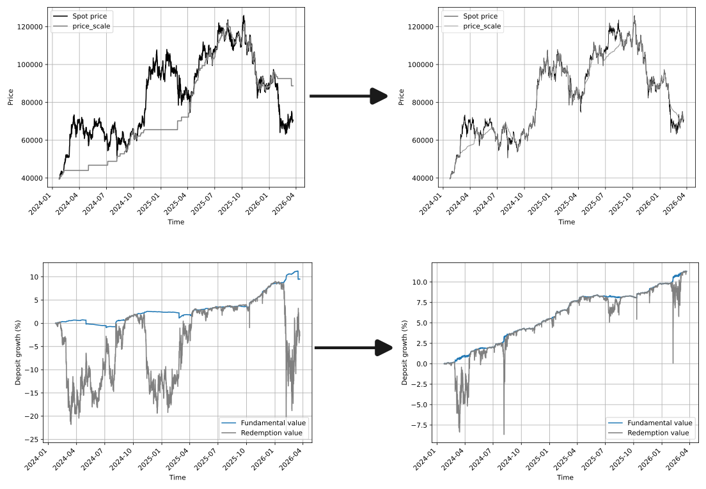

Data for this research can be found [on yb-simulations GitHub](https://github.com/yield-basis/yb-simulations/tree/master/btcusd/lpf%20vs%20old).

### Following `price_scale`

Starting from the middle of November, here is how `price_scale` for cbBTC pool as an example appears to follow the real prices:
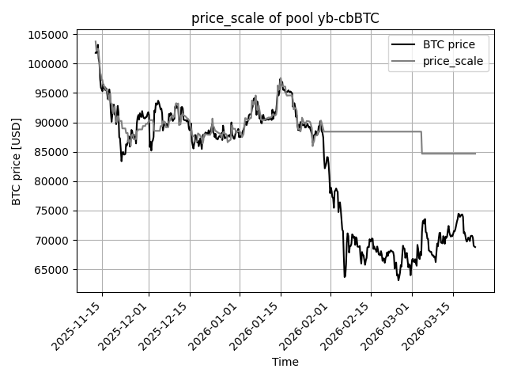

You can see that `price_scale` followed real prices for some time, and then deviated.

And here is what you can see if we try to simulate the behavior of the pool for exactly the same timeframe with exactly the same parameters:
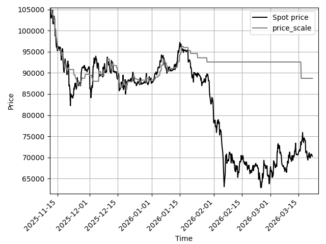

Simulations under-estimate performance of the pool slightly. This is fair because simulations ONLY account for arbitrage between pool and centralized exchanges and totally ignore any extra natural flow through the pools. Biggest extra revenue contributor in real pool in comparison with simulations is transactions involving liquidations in lending platforms. Due to those, pool earns slightly more than we simulated, and real performance is somewhat better.

Let's zoom simulations out to check the range from start of 2025 till now:
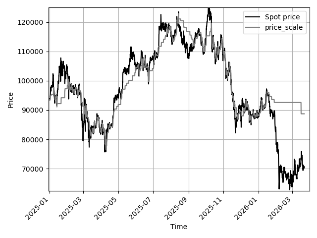

You can see that volatility from the start of 2025 was probably lower than it become later, so `price_scale` was following the real prices nicely until late February 2026.

Let's zoom out even more and see from the start of 2024:
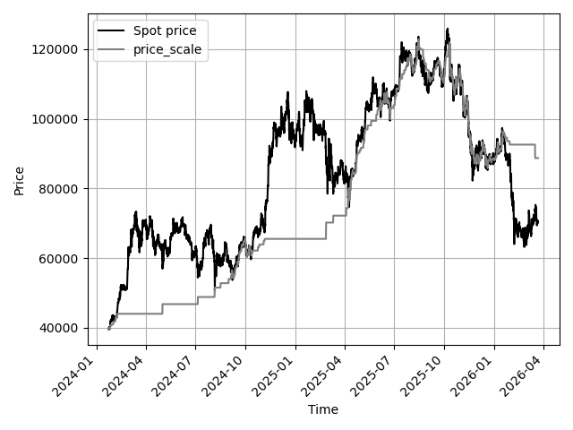

In 2024, performance of these parameters (due to a much higher short-term volatility) would have been not great also. However, we probably ARE in the same regime as before 2025 now! With current parameters optimal for 2025, the durations of "depegs" could be really large (months).

Another notable feature: `price_scale` is changed in large steps. This is undesirable because it leads to sudden leaks of value to arbitrage traders which can be avoided.

### Pool imbalance

Ideally, Curve pool should consist of 50% BTC + 50% crvUSD, e.g. be balanced. It can at times deviate from that, but ideally we should seek to minimize this deviation: this minimizes TRD (temporary redemption discount) and pressure on crvUSD peg. Pool is ideally balanced when `price_scale = current_price`, however it disbalances when they are not equal, and the disbalance is higher when `A` is higher.

This is how balanced BTC pools practically were since November 2025:
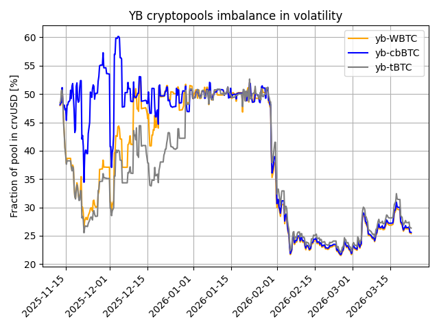

One can notice that pools went out of balance as much as 22%/78% in peak when `price_scale` deviated from current price now while the ideal "pegged" balance is 50%/50%.

Let's compare that with simulations over the same time period:
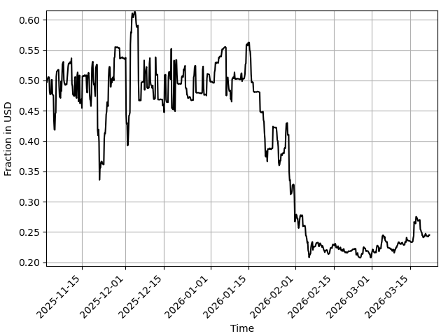

One can see that pools are even more imbalanced in simulations because `price_scale` catches up with reality faster than in simulations. It is important to compare because we *want* simulations to slightly under-estimate the performance.

Let's zoom out and see how it would have worked if we started in January 2025:
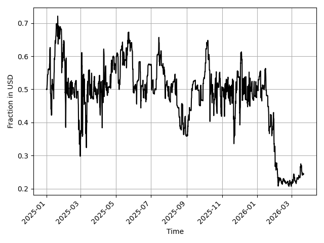

And if we started in January 2024:
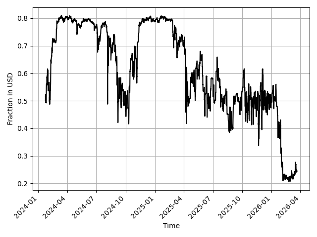

It's easy to notice that very long durations of "bullish imbalances" would have happened in 2024, making deviations up to 80%/20%, opposite direction to the current peak deviation 22%/78%.

### Deposit growth - fundamental value and redemption value

Measured growth from November 2025 till now for cbBTC pool:
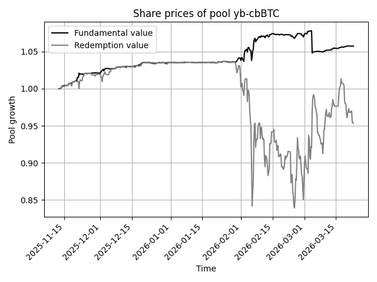

And over the same time period - simulated. The growth of simulated fundamental value is a bit smaller because simulations do not account for staked/unstaked split.
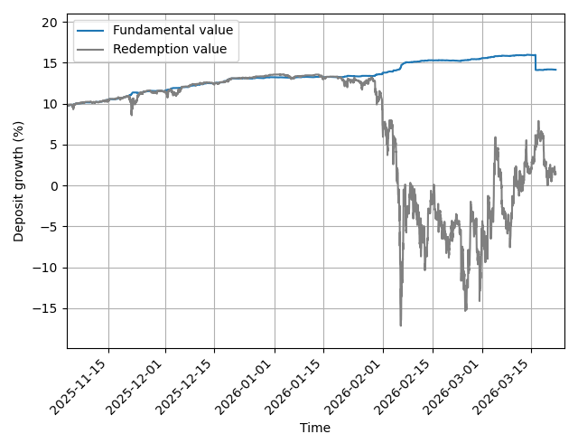

Temporary redemption discount is the difference between the two lines on the graph. Simulated TRD is a bit higher because the pool rebalances faster in reality.

If we simulate starting at January 2025:
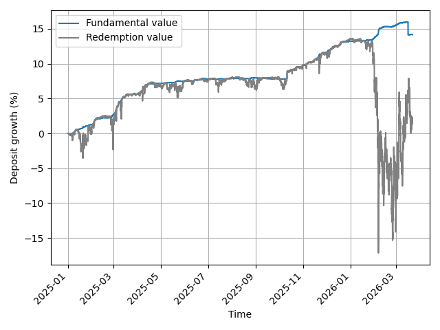

Again, we can see that parameters would have been workable for 2025 but not really after.

Let's simulate strting at earlier time - January 2024:
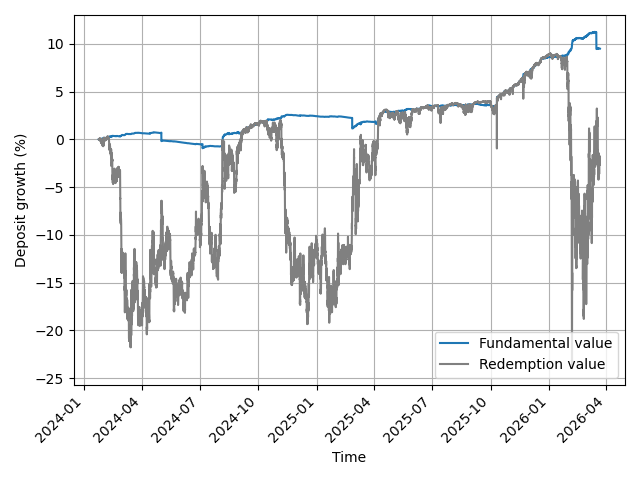

Here we see that similar TRD would have been happening in the past followed by the full recovery, however after a pretty long time.

### What are we fixing?

We want to fix the following problems most of which we see on the graphs:

- Very big and long-lasting TRD (redemption value drops). People may not want to wait several months when they are going to exit their positons;
- Large and long-lasting pool imbalances: same issue as what causes TRD, they also affect crvUSD peg limiting scaling;
- Pool asjustment of `price_scale` is too abrupt: that creates sudden drops in fundamental value. That is undesired, and also leaks some value to arbitrage traders;
- LevAMM behavior when pool is very imbalanced: we should always allow trades towards a smaller imbalance (not included on the graphs);
- Curve pools currently can only use 50% fees earned towards rebalancing. Making this fraction tunable appears to make a large difference, as we will see further.

## Improvements in simulations and pools

#### Methodology changes

Firstly, we want to discourage pool from being imbalanced. For that, when searching for maximum pool APR, we adjust it by an imbalance factor:
```  
avg_imbalance = average_over_time(
	1 - 4 * b_0 * b_1 * price_scale / (b_0 + b_1 * price_scale)**2
)
APR_adjusted = APR * (1 - 0.2 * avg_imbalance)
```
where `b_0` and `b_1` are balances of crvUSD and BTC in the pool. If pool was ideally balanced all the time, this average would have been zero, and `APR_adjusted` would be just equal to `APR`.

Secondly, we want to discourage times when APR is too low. For that, instead of calculating a "normal" APR, we calculate geometric mean of all the 2-month APRs defined in a moving window.

#### Pool algorithm changes

In currently operating BTC pools, price by which `price_scale` is adjusted is calculated as:
```
relative_price_step = max(
	(price_scale - price_oracle) / price_scale / 5,
	adjustment_step
)
```
This limits the `relative_price_step` on the lower end.

As it appears, limiting on the lower end does not improve performance at all, but limiting should instead be applied on the high end:
```  
relative_price_step = min(
	(price_scale - price_oracle) / price_scale / 5,
	adjustment_step
)  
adjustment_step ~= 0.5%
```  
This limits the price adjustment steps to be not larger than 0.5%. The method is already tested with WETH pool.

Another very important point: currently LP gets 50% of the fees earned by the pool, and another 50% of fees is getting spent on pool rebalances. This poses a question: what if 50/50 split is sub-optimal? It appears that it indeed is. After all optimizations we found that for global optimum of our new metric, LP profit fraction should be around 40% while we should spend around 60% on rebalances. 50/50 split which we caurrently have hard-coded appears to be a pretty unstable point on the edge of feasibility according to the new metrics we just introduced.

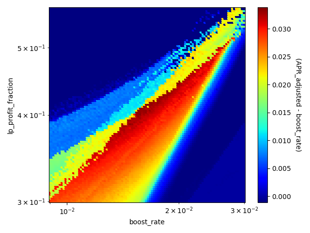

Optimal parameters found for BTC pools can be seen [here on GitHub](https://github.com/yield-basis/yb-simulations/blob/master/btcusd/lpf%20vs%20old/with_lpf/one.json)

### Following `price_scale`

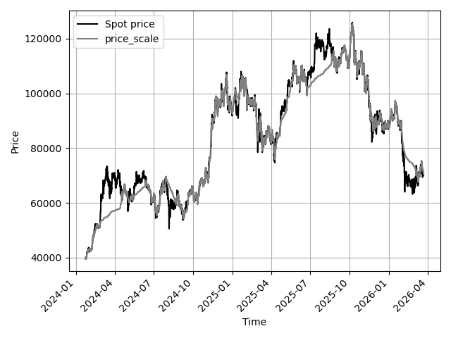

One can note that `_price_scale` is following prices much better than before. Interestingly, if we start simulations in 2025, the price follows slightly better (though it could be due to random nature of the prices)

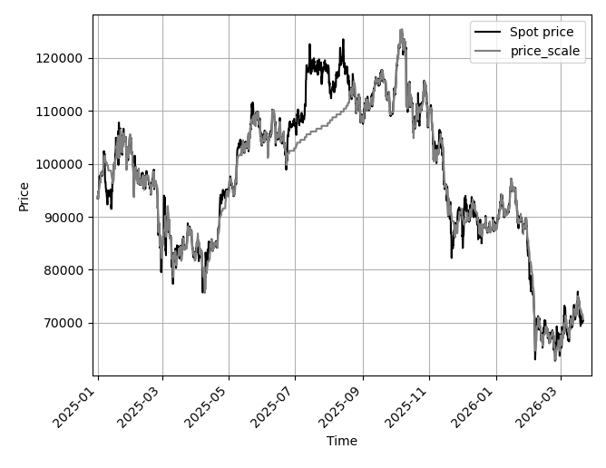

### Pool imbalance

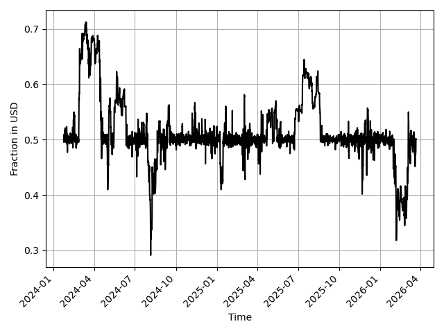

The imbalances at peaks reach 30%/70% and are much shorter than in the current pools. Interestingly, just like `price_scale`, they look a little bit better if we take data starting in 2025:

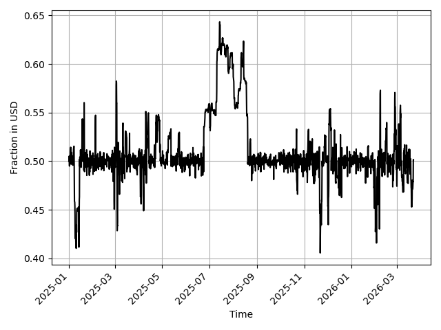

### Deposit growth - fundamental value and redemption value

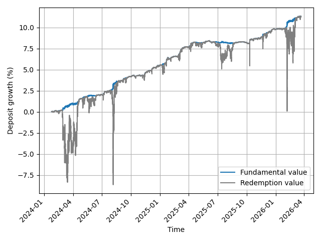

With the updated pool code and parameters, we see that deposit growth lacks sudden drops of fundamental value and has much smaller and shorter TRD - much more desirable for protocol users.

## Conclusion

Methodology for finding optimal parameters was improved, and necessary changes in pool code identified. We are able to decrease undesirable TRD by factor of 3 and its durations by probably up to an order of magnitude. Pressure on crvUSD peg is significantly reduced. Pool performance on average is comparable to what it was before.

We should be scaling Yield Basis with the improved pools. Necessary changes in the code are underway.